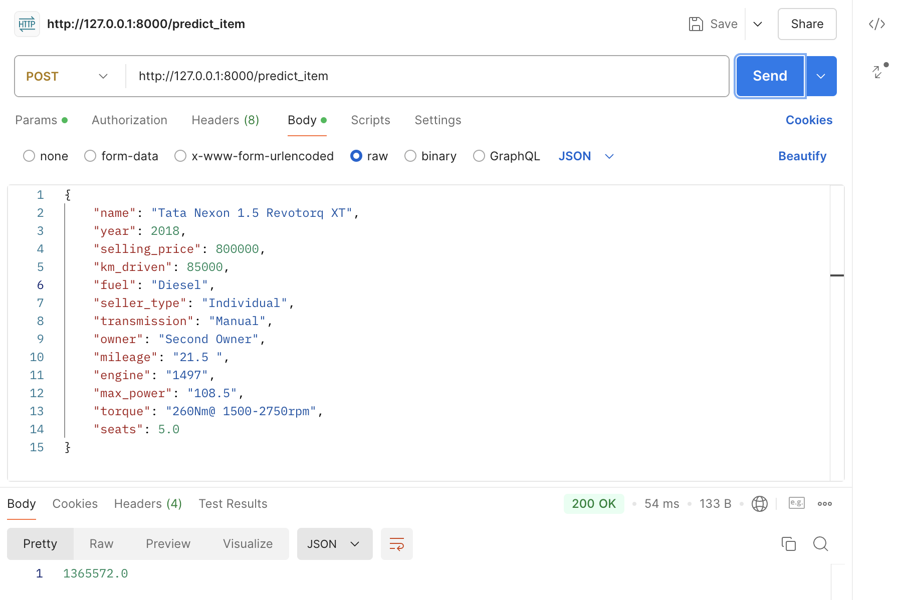
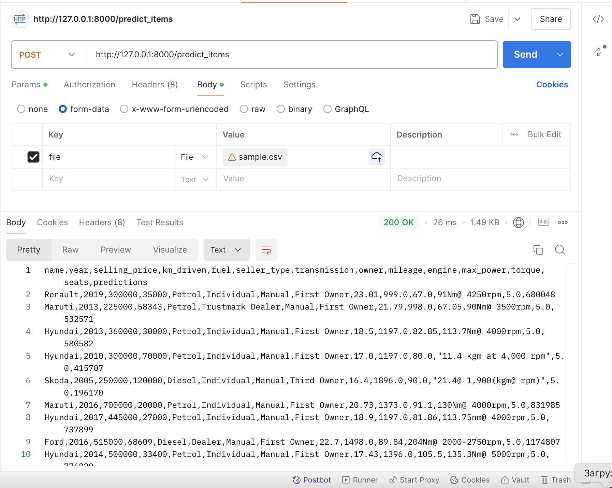

# Car Price Predictions

Репозиторий посвящен ДЗ1 по предмету "Машинное обучение" ВШЭ ФКН

Репозиторий вмещает в себя материалы ДЗ1: `Линейная регрессия с инфересном`, `Fast API`.

## Что было сделано

### 1. DS-часть

В ноутбуке `AI_HW1_Regression_base.ipynb` представлен код, в котором был проведен анализ датасета для обучения моделей, его обработка и подготовка к обучению.

После обработки данных было произведено обучение 6-ти моделей, предсказывающих цену автомобиля по определенным признакам.
В ходе обучения был проведен также `feature-engineering` данных для улучшения работы моделей.

#### Результаты

В результате были подготовлены данные и обучены модели:
* Модель 1: LinearRegression_not_scaled
* Модель 2: LinearRegression_scaled 
* Модель 3: Lasso_base
* Модель 4: Lasso_GSCV
* Модель 5: ElasticNet_GSCV 
* Модель 6: Ridge_GSCV

`GSCV` - обучение с применением Grid Search (с CrossValidation)

В результате обучения моделей в конце была составлена "бизнес-метрика", оценивающая предсказательную способность каждой модели по отдельности, в результате чего была выбрана `лучшая` модель для предсказания цен автомобилей. Эта модель далее пошла в реализацию пользовательского сервиса предсказания цен, реализованной через FastAPI.

Лучшим "бустом" в качестве обучения моделей являлось добавление категориальных признаков датасета (по методу OneHotEncoding), а также обучение моделей с помощью `Grid Search with Cross Validation` (внутри которой также осуществлялась регуляризация). Простая обработка данных в сравнении с другими моделями особых улучшений качества обучения не дало (был лишь небольшой прирост).

Качество работ моделей на обучающих и тестовых данных:
```bash
--------- Успешность предсказаний моделей на обучающей выборке ---------

Модель 1 (LinearRegression_not_scaled): 21.52%
Модель 2 (LinearRegression_scaled): 21.52%
Модель 3 (Lasso_base): 21.52%
Модель 4 (Lasso_GSCV): 20.60%
Модель 5 (ElasticNet_GSCV): 22.36%
Модель 6 (Ridge_GSCV): 26.71%

--------- Успешность предсказаний моделей на тестовой выборке ---------

Модель 1 (LinearRegression_not_scaled): 22.70%
Модель 2 (LinearRegression_scaled): 22.70%
Модель 3 (Lasso_base): 22.70%
Модель 4 (Lasso_GSCV): 23.30%
Модель 5 (ElasticNet_GSCV): 24.30%
Модель 6 (Ridge_GSCV): 30.30%
```

### 2. Продакшн-часть (FASTAPI)

Для выбранной лучшей модели из п.1 был реализован пользовательский сервис предсказания цен автомобилей.
Реализация сервиса представлена в файле `app.py`.

В сервисе реализованы два `POST` метода с следующими эндпоинтами:

1. `/predict_item` - реализация сервиса по предсказанию цены на ОДИН автомобиль, имеющий свои характеристики
2. `/predict_items` - реализация сервиса по предсказанию цен на автомобили в подаваемом датасете формата `.csv`

#### Результаты

Работа сервиса основана на методах `POST`. С сервисом удобнее всего работать через приложение `Postman`, однако можно работать и через стандартный `CURL`.

После запуска приложения с помощью команды: 
```bash
uvicorn app:app --reload
```
пользователь подключается по адресу `http://127.0.0.1:8000`, выбирая для себя нужный endpoint, в которых может сделать следующее:

1. Для `/predict_item` пользователь отправляет POST запрос примерно с следующим содержимым тела запроса:

```json
{
    "name": "Tata Nexon 1.5 Revotorq XT",
    "year": 2018,
    "selling_price": 800000,
    "km_driven": 85000,
    "fuel": "Diesel",
    "seller_type": "Individual",
    "transmission": "Manual",
    "owner": "Second Owner",
    "mileage": "21.5 ",
    "engine": "1497",
    "max_power": "108.5",
    "torque": "260Nm@ 1500-2750rpm",
    "seats": 5.0
}
```

В результате пользователь получает от сервиса ответ - предсказание цены автомобиля для поданного объекта:
```bash
1365572.0
```

2. Для `/predict_items` пользователь отправляет через `POST` запрос уже некоторый .csv файл, в результате которого в ответ он получает обратно другой csv с такими же данными, за исключением того, что в файле таблицы добавляется колонка `predictions` с предсказанными ценами на каждый автомобиль. Этот csv файл будет называться `predictions.csv`

#### Примеры работы сервиса

1. `/predict_item`:



2`/predict_items`:



### Материалы репозитория

Репозиторий содержит следующие файлы:
* `data/sample.csv` - файл-пример, подаваемый API для реализации сервиса предсказания цен автомобилей по методу `/predict_items`
* `data/predictions.csv` - файл-пример, получаемый от API в результате реализации предсказания цен автомобилей по методу `/predict_items` из `sample.csv` файла
* `AI_HW1_Regression_base.ipynb` - ноутбук с DS частью - обработкой данных и обучения моделей с последующим их улучшением и выбором лучшей
* `app.py` - код сервиса по предсказанию цен автомобилей
* `features.pkl` - pickle файл с необходимыми фичами для обученной лучшей модели
* `ridge_model.pkl` - pickle файл обученной модели по предсказанию цен автомобилей
* `img/post_csv_sample_to_API.png` - скриншот-пример работы сервиса FASTAPI по предсказанию цен автомобиля
* `img/post_json_sample_to_API.png` - скриншот-пример работы сервиса FASTAPI по предсказанию цен автомобиля
